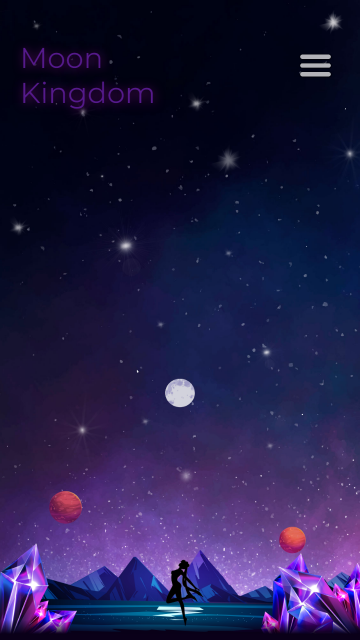

# Moon Kingdom - Responsive Parallax Scrolling Webiste inspired by Sailor Moon

Initially, it was supposed to be just an exercise to create a Parallax Scrollin Website. Only for desktop preview.
Finally, I made an entire landing page out of it.
Using desktop-first. Webiste inspired by Sailor Moon.

## Screenshot

 

## Demo

- A live demo can be found [here]()

## Built with

- Photoshop
- HTML5
- CSS3/Flexbox/pseudo-elements
- Desktop First
- A little JS

## Photos

All images are from freepik.com and pinterest.com
[upklyak](https://www.freepik.com/author/upklyak),
[vectorpouch](https://www.freepik.com/author/vectorpouch),
[vectorpocket](https://www.freepik.com/author/vectorpocket),
